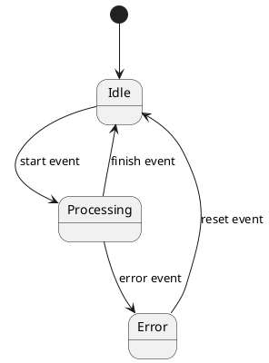
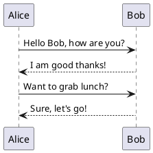

# First diagram

```plantuml
@startuml
[*] --> Idle

Idle --> Processing : start event
Processing --> Idle : finish event
Processing --> Error : error event
Error --> Idle : reset event
@enduml
```

# Second diagram

```plantuml
@startuml
Alice -> Bob: Hello Bob, how are you?
Bob --> Alice: I am good thanks!
Alice -> Bob: Want to grab lunch?
Bob --> Alice: Sure, let's go!
@enduml
```
